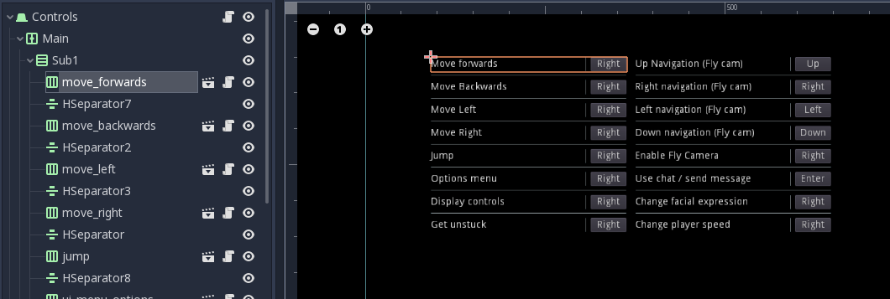

Options Component
=================

Properties
----------

+-------------------------+----------------------------------+
| :godot_class:`string`   | :ref:`label text<OC_label_text>` |
+-------------------------+----------------------------------+

Description
-----------

This button allows the user to identify the name and the currently assigned key for an action. This is a scene located at `"res://assets/UI/Menu/control_option_component.tscn"` when instanced in another scene it is important to note the following requirements:

* The name of the node should be the same as the action that it will change, like in the following example:

* To change the text displayed in the button, change the **Label text** field in the script variables.

Properties descriptions
-----------------------

.. _OC_label_text:

This is the text that will be displayed when changing settings. 
