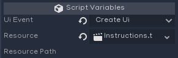

UIElement
=========

Description
-----------
To quickly hook up buttons and other UI elements the UIElement script can be used. This script needs to be attached to a node, and then configured using the inspector. The script uses the functions in the UIManager.

UIEvents
--------

* **Back**
  Go to the previous UI.
* **Create UI**
  Show a new UI using either the path or the PackedScene variable.
* **Queue UI**
  Add a new UI to the queue, will be displayed if there is currently no UI or once Dismiss is used on the current UI.
* **Set Setting**
* **Dismiss**
  Remove the current UI and continue to the next UI if one is available.
* **Load Level**
  Use the level loader to switch to a new scene.
* **Join Server**
* **Run Locally**
* **Exit**
  Closes the game, returning to desktop
